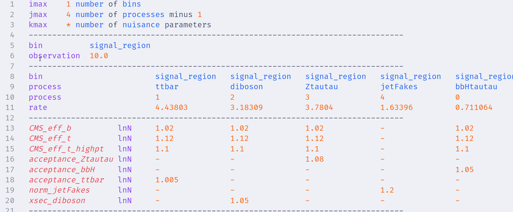
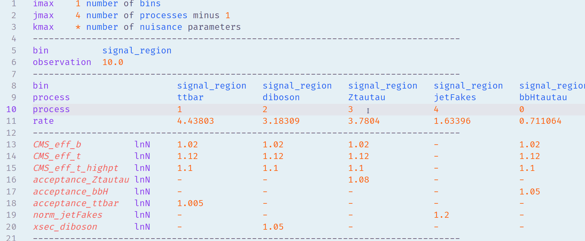
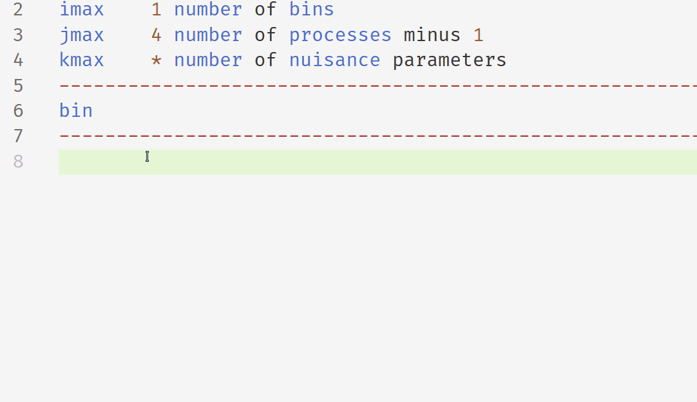

# VSCode extension for datacards from the [CMS Combine](https://cms-analysis.github.io/HiggsAnalysis-CombinedLimit/latest/) tool

## Features ✨

- Semantic syntax highlighting for keywords and numbers

    

- Fold blocks within datacards

    

- Comment toggling

    

- Context-aware suggestions for keywords and section dividers

    

## Coming soon 🔜

- Tooltips for keywords
- Breadcrumbs for datacard sections
- Auto-aligning table columns
- Sticky scrolling for table headings
<!-- - Use the CombineHarvester `ValidateDatacards.py` tool to validate datacards on-the-fly -->

## Installation 🧑‍💻️

To install this extension from the marketplace, launch `VSCode`, press `Ctrl+P` and paste the following:

```bash
ext install cms-combine-datacard
```

To build and install this extension locally:

```bash
npm install --save-dev @vscode/vsce
npx vsce package
code --install-extension cms-combine-datacard-<version>.vsix 
```
